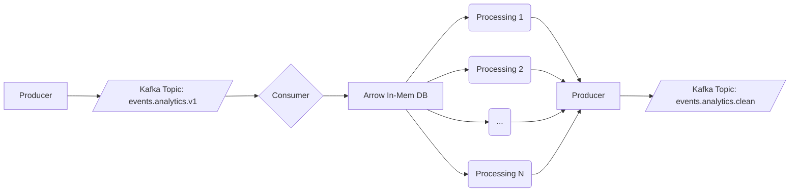

# Dispatch play

Small consumer and producer to play around with fan-outs of consumer work.

Expects a local kafka cluster to be running and exposed on `localhost:9021` (no auth).
Personaly, using a small dockerized single node Confluent cluster ([local-confluent](https://github.com/VinceDeslo/local-confluent)).

### Getting up and running

```bash
nixd
just fmt
just run
```

### Implementation plan
- [x] protobuf serde over a topic with an "Analytics" message structure.
- [ ] register schema via schema registry.
- [ ] spawn threads to handle analytics events in parallel (fan-out).
- [ ] load payload into arrow for stream processing.
- [ ] dispatch calculations to new topic (fan-in).
- [ ] sink into some form of end storage (Parquet in S3 if I'm not too lazy).

### Diagram


